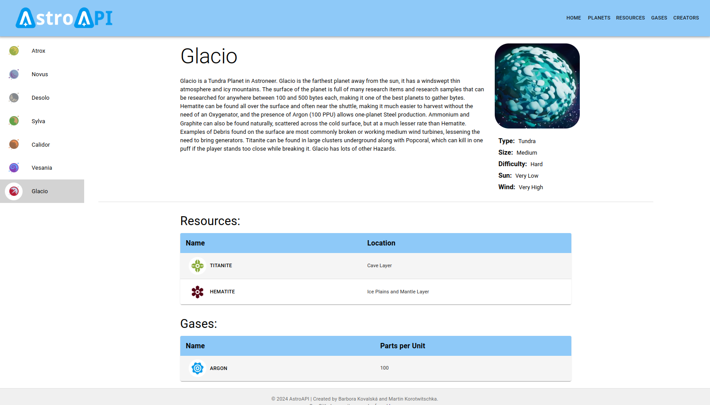
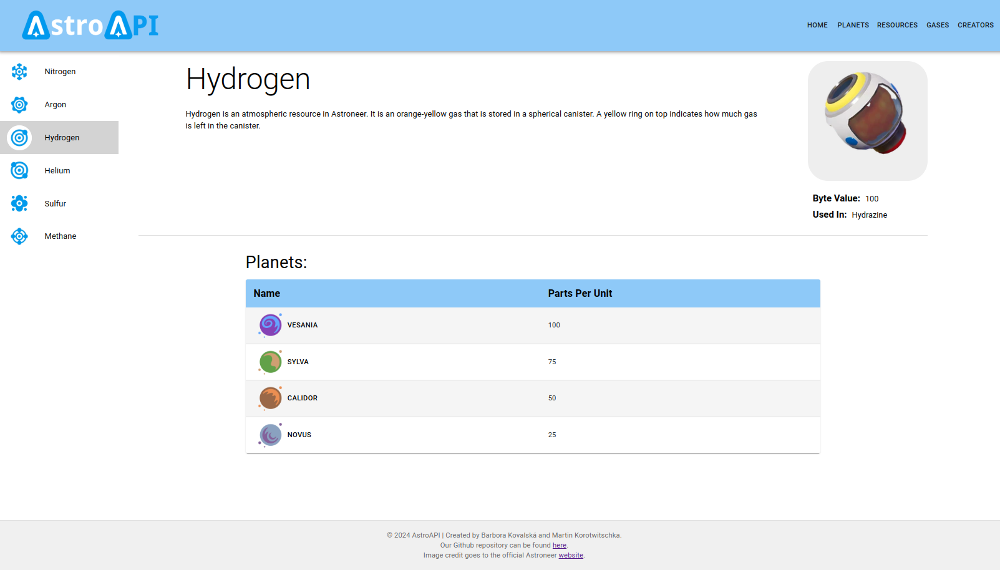
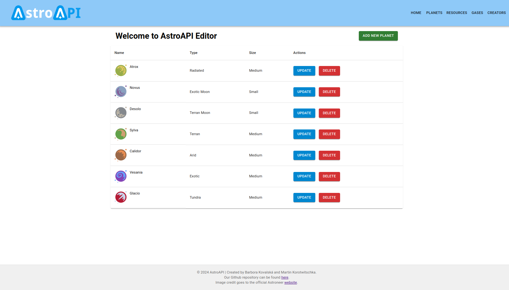

# Astro-API

A small API &amp; React app implementation based on the Astroneer game, created for OUR JavaScript course. Here is the specification of the project: [Astro-API](https://docs.google.com/document/d/1mbYYzY0j7Xq8KX8a2ei2_Ta1AQUWpfcpD0tORZt8AD4).

The app allows for creating, updating, deleting and viewing planets, their atmospheric gases and resources, mirroring the format set in the Astroneer game. Initially, our database is populated with test data from the actual game and the user is able to create new planets.

The app is connected to a database and uses Prisma as an ORM. Frontend is actually written in Typescript React and backend in Javascript (We forgot to set it up in Typescript).

## Run

- Clone the repository
- Create an `.env` file with `cp .env.example .env`
  - No need to change anything actually
- You can setup it by yourself or **just run `npm run setup`**, no other work needed for frontend or backend
  - After that you could write
    - `npm run be` to start backend
    - `npm run fe` to start frontend
- **Pro tip**: If you want to edit anything, after work just run prettier. For example with `prettier --write .` or with `npx prettier --write .` so everything will be nicely formatted 😊

### Backend

- First, install dependencies with `npm i`

- For first build, you have to setup prisma
  - Install prisma with `npm i prisma --save-dev` (you don't have to you already have it)
  - Run `npm run migrate` to create the database
  - Then, run `npm run seed` to insert some test data
- Working with the database
  - To update the schema, run `npm run migrate`
  - Optionally, run `npx prisma studio` to open the prisma studio
- **Run dev**: `npm run be`

### Frontend

- Change directory into the `fe` directory with `cd fe`
- First, install dependencies with `npm i`
- And now you can run the react app
  - **Run dev**: `npm start` in the `fe` directory (you should be there)

## Assignment TODO

**Back-end (NodeJS):**

- 5 Functional requirements
  - [x] At least 2 resources (2 tables connected to each other via key)
  - [x] All CRUD operations on one resource
  - [x] At least 2 operations on second resource
- 5 ORM Layer
  - [x] Connection to the DB via a ORM library
  - [x] Error handling
- 5 Express REST API layer
  - [x] Valid API up to the REST specification for all operations on resources
  - [x] Status handling & error messages

**Front-end (React):**

- 5 Functional requirements
  - [x] App Layout with Navigation (Routing)
  - [x] Main page with information about the app
  - [x] All CRUD operations on one resource (Create Form, Edit Form, List/Table, Delete, Detail View)
- 5 Component structure
  - [x] Split your application into several components. Don’t make huge ones.
- 5 Client-side routing
  - [x] There should be proper routes for all pages
  - [x] Best practices according to react router
- 5 Data fetching
  - [x] Custom API functions
  - [x] Proper loading states
  - [x] Proper error handling / states

**Overall:**

- 5 Code quality / project setup
  - [x] README, Prettier, Able to run the whole project easily!

## Showcase

The pages are used for simple CRUD operations on planets, gases and resources, so the frontend isn't anything breathtaking. But we still tried to make it look nice and clean.

## Note

- We ran out of time sadly... But we tried really hard to make it work 😅
- The commits after deadline are just for the sake of the project, we didn't want to leave it unfinished
- There are no easter eggs, so don't even bother looking

> And so the scholarship was somehow saved...
